# Smart Curriculum Designer

An AI-driven educational framework that integrates automated curriculum generation with an end-to-end computer vision pipeline, enabling learning for high school and undergraduate students combining domain agnostic datasets with machine learning and AI concepts.

### License

[](./LICENSE) 

**Tags:** `AI4CI`, `CI4AI`, `Foundation-AI`, `Visual-Analytics`

## References

- [Tapis v3 — HPC job execution framework](https://tapis-project.org)
- [DINOv2 — Learning Robust Visual Features without Supervision](https://github.com/facebookresearch/dinov2)
- [Segment Anything (SAM) — Meta AI Foundation Model](https://github.com/facebookresearch/segment-anything)
- [San Diego Supercomputer Center (SDSC Expanse)](https://www.sdsc.edu/support/user_guides/expanse.html)
- [Ohio Supercomputer Center (OSC)](https://www.osc.edu/)
- [ICICLE AI Institute](https://icicle.ai/)

## Acknowledgements
*Developed at The Ohio State University (Systems and AI Lab, advised by Dr. Hari Subramoni), subsequently submitted to and implemented as part of the AI Presidential Challenge, with domain expertise and educator feedback from Dr. Scott Shearer and Dr. Lisa Abrams, and pilot deployment support from the Columbus School for Girls.*

## Issue reporting

Please open an issue at [github.com/ICICLE-ai/curriculum-generator/issues](https://github.com/OSU-SAI-Lab/curriculum_generator/issues) with a description of the problem, steps to reproduce, and any relevant logs from pipeline runs or cluster jobs.

## Tutorials

- **Step-by-Step Tutorials & Deployment:** [HOW_TO_USE.md](./HOW_TO_USE.md)
- **YAML Configuration Guide & Reference:** [YAML_CONFIG_GUIDE.md](./YAML_CONFIG_GUIDE.md)
- **Curriculum Module Reference:** [TEMPLATES_GUIDE.md](./TEMPLATES_GUIDE.md)

---

### Project Philosophy: The Pipeline is the Curriculum

Traditional AI education frequently treats machine learning as a simplified black box using sterile datasets that mask real-world data science challenges. DigitalAgEdu adheres to the principle that **the pipeline itself is the curriculum**. 

Rather than working on generic toy examples, learners execute an end-to-end foundation model pipeline on authentic domain datasets (agriculture, dermatology, disaster response, etc.). The metrics, class imbalances, confusion matrices, and segmentation masks generated during execution are dynamically injected into scaffolded Python exercises. Students dissect, recreate, optimize, and explain the exact stages they just witnessed.

```
       Image Dataset (Any Domain / Kaggle / Tapis)
                          │
                          ▼
    [1] Dataset Ingestion         (Class discovery, validation, sample audits)
                          │
                          ▼
    [2] DINOv2 Classification     (Transfer learning & robust visual representation)
                          │
                          ▼
    [3] SAM Segmentation          (Promptable region-of-interest mask extraction)
                          │
                          ▼
    [4] Grad-CAM Explainability   (Class activation heatmaps & visual evidence)
                          │
                          ▼
    [5] Artifact Packaging        (curriculum.json, syllabus markdown, results.csv, assets)
                          │
                          ▼
    [6] Multi-Agent Synthesis     (Multi-week syllabus & widescreen lecture slides)
                          │
                          ▼
    [7] Exercise Scaffolding      (Scaffolded starter code & PyTorch solutions)
                          │
                          ▼
    [8] Sandboxed Verification    (Property-based unit tests & self-healing loops)
```

### End-to-End Architecture

The DigitalAgEdu architecture consists of decoupled modular systems:

- **Orchestrator & Scanner (`digitalagedu/core/`):** Ingests YAML configurations, parses image directories, computes class distributions, and validates execution readiness.
- **Foundation Vision Pipeline (`curriculum_resources/`):** Houses execution stages for DINOv2 classification (`curriculum_resources/classification/`), SAM segmentation (`curriculum_resources/segmentation/`), and Grad-CAM visual explainability (`curriculum_resources/xai/`).
- **Autonomous Multi-Agent Curriculum Engine (`digitalagedu/core/llm/`):** 3-agent cooperative synthesis pipeline authoring lesson overviews, scaffolded coding exercises, reference solutions, sandboxed unit tests, and lecture slides.
- **Smart Curriculum Designer Web Portal (`frontend/`):** Visual web application delivering interactive pipeline design, 1-click HPC cluster job submission via Tapis v3, and live pipeline stage monitoring.
- **Supercomputing Infrastructure:** Managed job execution on SDSC Expanse with Lustre high-performance scratch storage and Slurm GPU allocation.

### Computer Vision Foundation Models

- **DINOv2 (Vision Transformer Backbone):** Utilizes self-supervised Vision Transformers (ViT) to extract domain-invariant image representations. Enables high classification precision without requiring massive labeled training sets.
- **Segment Anything Model (SAM):** Generates zero-shot promptable segmentation masks to isolate regions of interest (e.g. lesion borders, leaf foliage, flood zones).
- **Grad-CAM (Visual Explainability):** Generates gradient-weighted class activation mapping (CAM) heatmaps to highlight exact visual regions influencing classification decisions, teaching students interpretability and saliency analysis.

### Autonomous Curriculum Generation Process

The generation engine in `digitalagedu/core/llm/` operates via a multi-agent, Test-Driven Development (TDD) workflow that grounds educational content directly in empirical pipeline telemetry:

1. **Telemetry & Provenance Ingestion:** Loads execution telemetry from the computer vision stages (`results.csv`, confusion matrix heatmaps, segmented mask fixtures, class distributions, and runtime performance).
2. **Syllabus Architecture:** When explicit modules are not pre-defined in YAML, the Syllabus Architect agent reviews dataset metadata and performance characteristics to formulate a multi-week academic syllabus (`syllabus_plan.json`, `course_syllabus.md`) with progressive difficulty.
3. **Agent 0 (Problem Formulation & Subsystem Contracts):** Deconstructs each weekly topic into concrete student learning objectives, domain context, and formal subsystem component contracts (`[topic]_overview.md`), linking each topic to verified workflow artifact IDs (`[topic]_manifest.json`).
4. **Agent 2 (Test-First QA Specification):** In accordance with TDD principles, Agent 2 writes property-based unit tests *before* code implementation. The test suite asserts tensor shapes, return types, and algorithmic behavior based on the subsystem contracts (`[topic]_test.py`).
5. **Agent 1 (Reference Solution Synthesis):** Implements the complete PyTorch reference solution designed to pass the unit tests authored by Agent 2 (`[topic]_solution.py`).
6. **Execution Sandbox Verification & Self-Healing:** The synthesized solution and unit tests are executed inside an isolated runtime sandbox (`run_in_sandbox`). If any assertion or syntax error occurs, root-cause diagnosis automatically triggers targeted self-healing retries for either Agent 1 (solution fixes) or Agent 2 (test corrections) until verification succeeds (`[topic]_verification.json`).
7. **Exercise Scaffolding:** From the verified reference solution, student starter code is generated with guided docstrings, `# TODO` implementation milestones, and structural type hints (`[topic]_exercise.py`).
8. **Automated 16:9 Presentation Synthesis:** The Presentation Designer synthesizes structured presentation schemas incorporating pipeline diagrams, evaluation metrics, and theoretical concepts into formatted widescreen PowerPoint slide decks (`[topic]_presentation.pptx`).
9. **Cumulative Memory Ledger:** Updates a state ledger across academic weeks, ensuring subsequent modules build upon concepts introduced in earlier weeks without redundant backtracking.
10. **Packaging & Lineage Reconciliation:** Packages student dependencies (`requirements.txt`), master curriculum syllabi (`curriculum.json`, `curriculum_grade_[grade].md`), and reconciles bidirectional artifact lineage into `provenance.json`.

### Smart Curriculum Designer Web Portal

The framework includes a modern web portal providing visual workflows for educators and students:

- **Config Studio (`/config`):** Visual curriculum designer with 5-step segmented navigation (`Course & Data`, `Vision Tools`, `Syllabus`, `Weekly Labs`, `Lab Settings`), pre-configured domain presets (Skin Cancer, Plant Diseases, Food-10k), dynamic cluster dataset scanning via Tapis Files API, and a live YAML preview with export capabilities.
- **HPC Job Submission (`/submit`):** 1-click job submission to SDSC Expanse using the Tapis v3 Jobs API. Automatically synchronizes cluster scratch roots, config file locations, Slurm GPU allocation (`--gpus=1`), and Slurm project accounts (`-A uot260`).
- **Live Pipeline Monitor (`/monitor`):** Real-time stage stepper telemetry tracking active pipeline progression (`dataset_ingestion` → `classification` → `segmentation` → `curriculum_synthesis` → `exercise_generation` → `packaging`), cluster heartbeat monitoring, stdout log inspection, and 1-click artifact downloaders.
- **Token & Identity Management (`/token`):** Inspects CILogon / ICICLE Tapis JWTs, provides 1-click 30-day refresh token generation, and handles +4-hour access token renewals.

### Supercomputing Infrastructure (SDSC Expanse & Tapis v3)

- **Cluster Computing:** Scalable compute executed on San Diego Supercomputer Center's (SDSC) Expanse supercomputer utilizing NVIDIA V100/A100 GPU nodes.
- **Fast I/O Scratch Storage:** Jobs execute within dedicated Lustre scratch storage (`/expanse/lustre/scratch/harvest/temp_project/`) for rapid dataset throughput.
- **Tapis v3 Distributed Framework:** Secure job submission, file transfers, and system management using standard Tapis v3 APIs (`/v3/jobs`, `/v3/files`, `/v3/systems`, `/v3/tokens`).

---

# Step-by-Step User Guide & Portal Walkthrough

This documentation goes over how to use the **Smart Curriculum Designer**, the machine learning and AI curriculum generator. The application enables educators to generate models, content, exercises, and solutions, weaving the domain/dataset specified by the educator.

---

## Getting Started

This application uses Tapis. If you already have an account and a system authenticated, you may skip this section.

### 1. Log in to Tapis
Navigate to [https://icicleai.tapis.io/#/login](https://icicleai.tapis.io/#/login). You will be prompted to log in. Select **University Accounts (CILogon)**. 

*(If you do not have an ACCESS account, you can create one at [https://account.access-ci.org/register](https://account.access-ci.org/register)).*

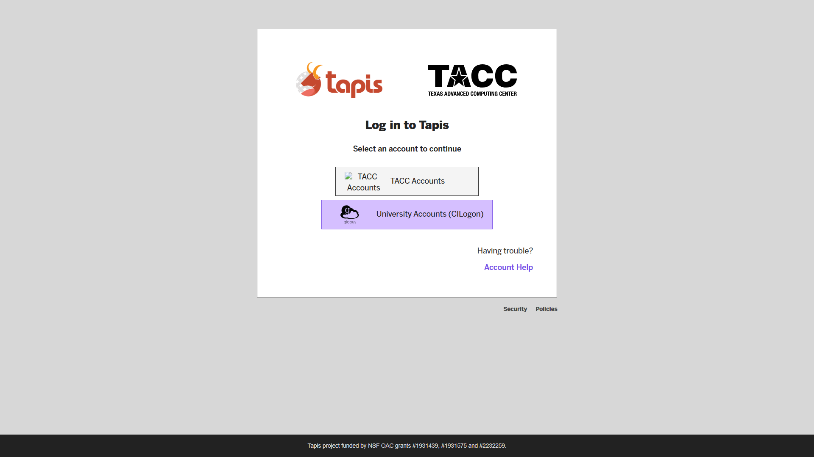

### 2. Select Your Institution
Select the university or institution that you are affiliated with to log in through your standard single sign-on (SSO).

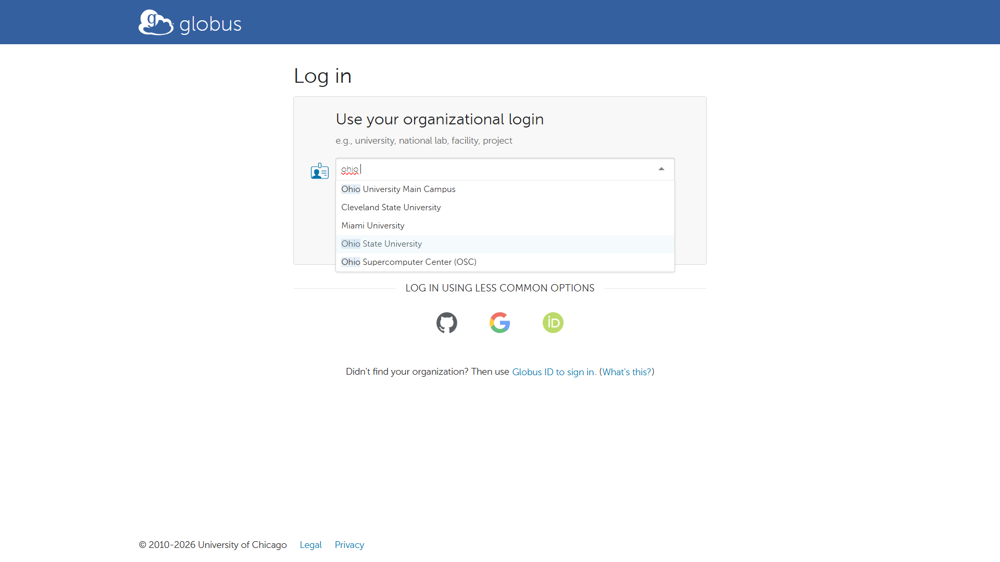

### 3. Tapis Main Dashboard
After logging in, you will be shown the main page for ICICLE's Tapis platform.

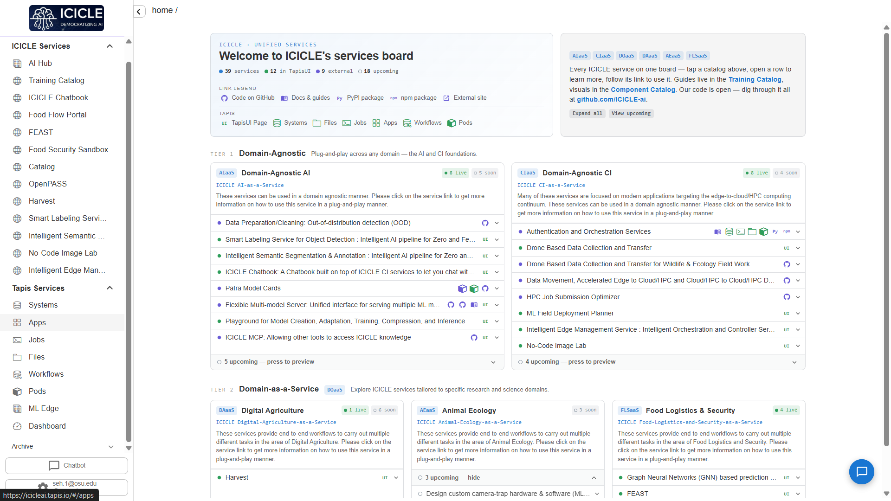

---

## End-to-End Example

### 1. Retrieve Your Tapis JWT Token
Navigate to [https://smartcurriculumdesigner.pods.icicleai.tapis.io/](https://smartcurriculumdesigner.pods.icicleai.tapis.io/) and [https://icicleai.tapis.io/#/home](https://icicleai.tapis.io/#/home). 

You will need your JWT token to log in to the Smart Curriculum Designer portal. To do so, in the Tapis Portal, click the **Gear Icon** in the top navigation bar, and select **Copy Token**.

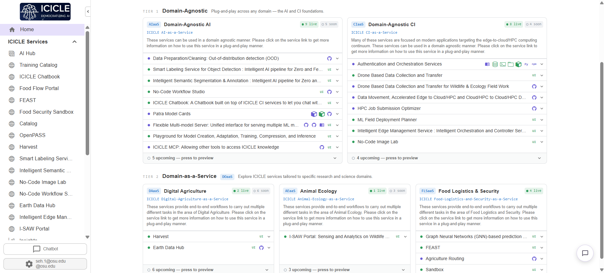

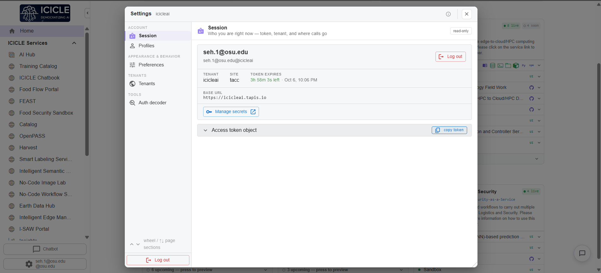

### 2. Authenticate to the Portal
Navigating back to [https://smartcurriculumdesigner.pods.icicleai.tapis.io/](https://smartcurriculumdesigner.pods.icicleai.tapis.io/), you will be met with a screen requesting your JWT token. Paste it in and click **Authenticate Token** to log in.

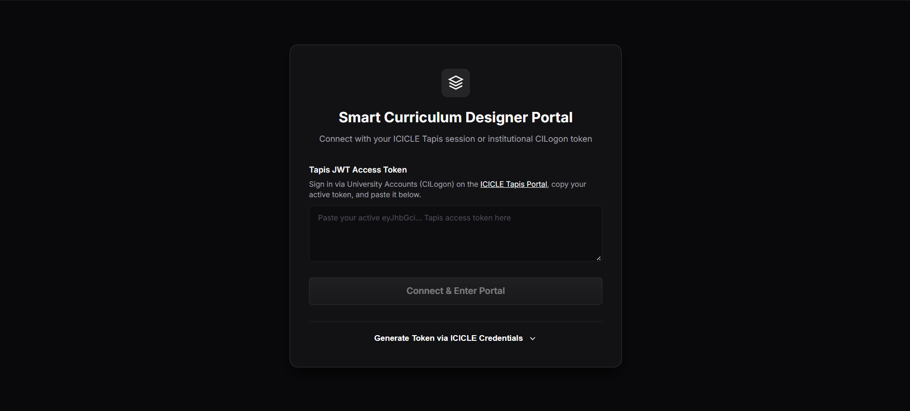

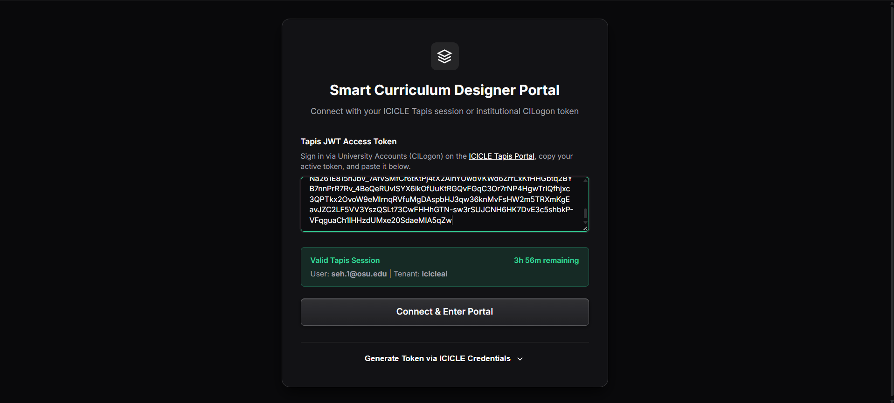

### 3. Curriculum Configuration Studio
After logging in, you will see the primary interface. Navigate to **Curriculum Config**.

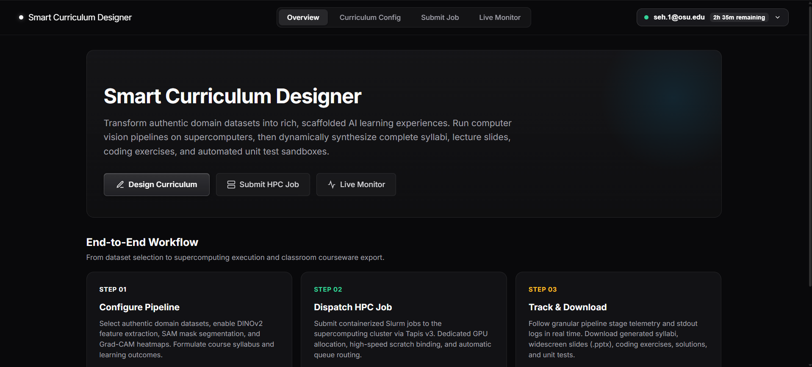

This page is where you configure your curriculum parameters, divided across 5 guided sections:
- **Course & Data**
- **Vision Tools**
- **Syllabus**
- **Weekly Labs**
- **Lab Settings**

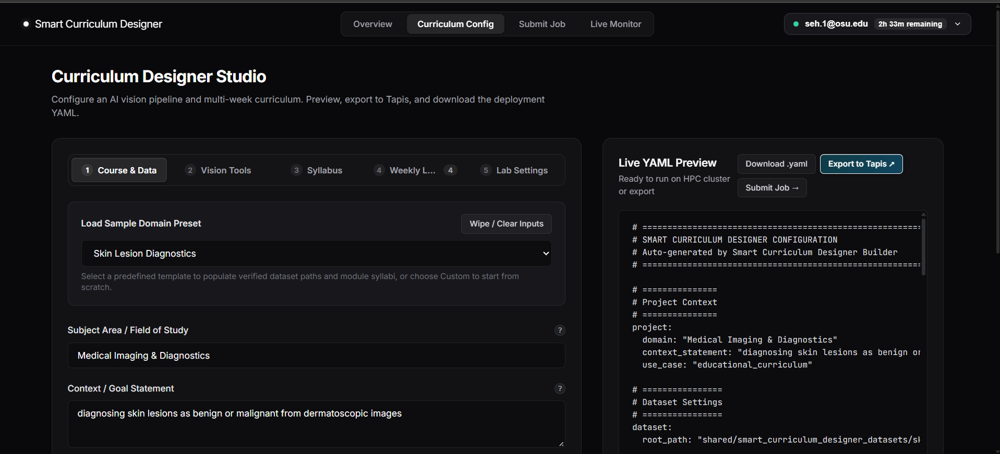

> [!TIP]
> If you are ever unsure about what a specific setting does, click on the **(?)** help button next to the field to display its purpose, default value, and HPC context.

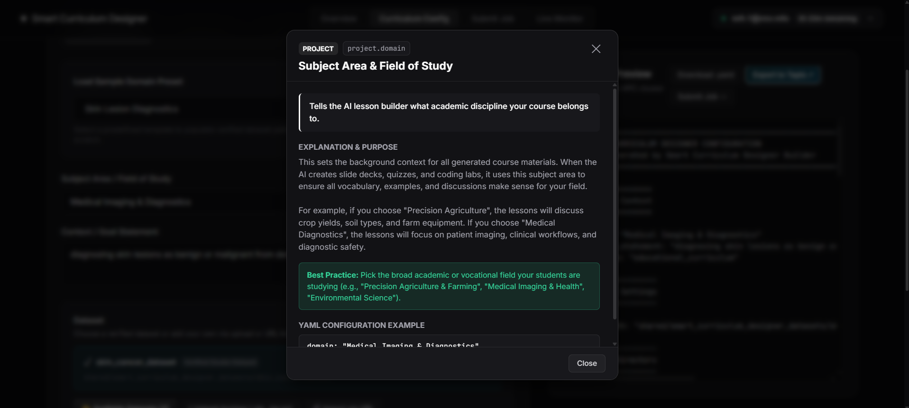

For this walkthrough, select the preset **Skin Lesion Diagnostics**. Review your parameters, then click **Export to Tapis**. This will automatically upload your generated YAML configuration into your user folder in cluster storage.

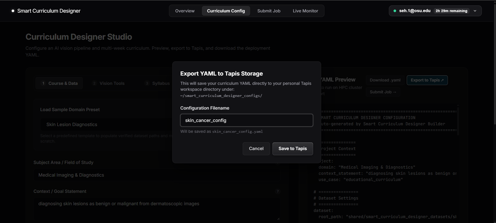

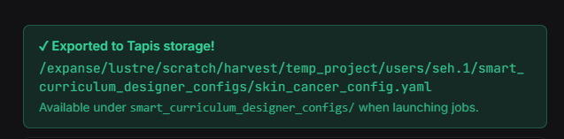

### 4. Submit Job to HPC Cluster
Navigate to **Submit Job** in the top navigation.

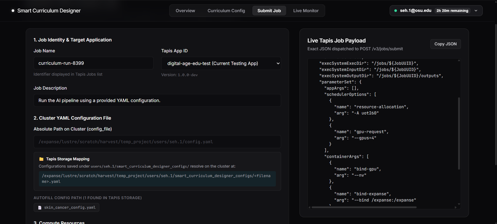

Here you can customize job options. The primary requirement is the YAML configuration file: since we clicked **Export to Tapis** in the previous step, your exported configuration file will appear in the discovered files list. Click it to populate the path automatically.

Specify the number of GPUs you wish to allocate (default is 1 GPU), and review compute settings as needed.

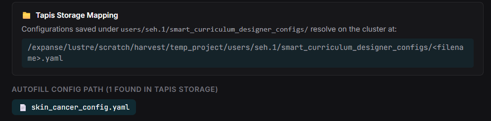

Click **Submit Batch Job 🚀**.

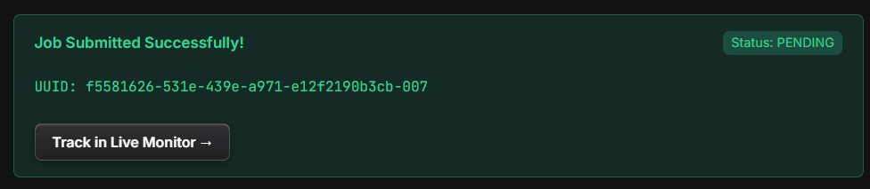

### 5. Monitor Live Job Execution
Next, navigate to the **Live Monitor** page (either by clicking **Track in Live Monitor →** on the success banner or using the top navigation bar). 

Here you can monitor the status of your job, track each pipeline stage in real time, inspect live stdout/stderr logs (`tapisjob.out`), and see execution telemetry.

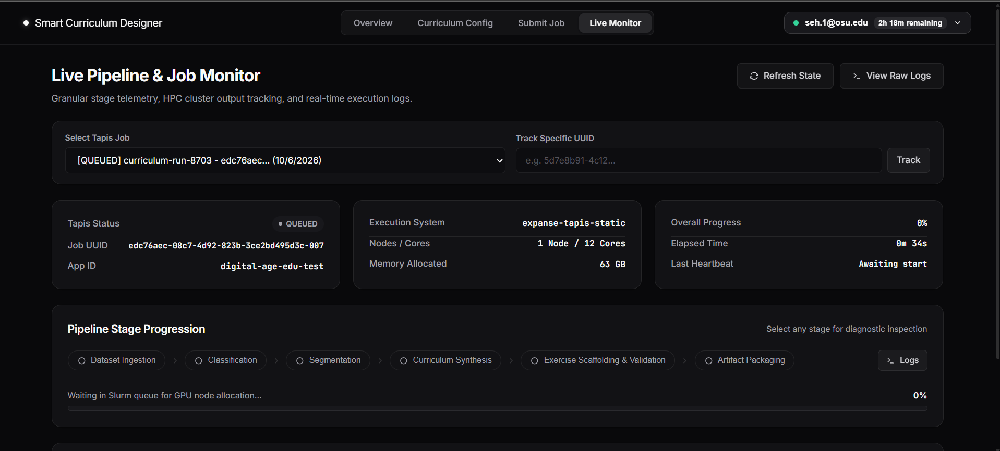

---

## Understanding the Outputs

Once the job status changes to **FINISHED**, all deliverables are ready for inspection and download.

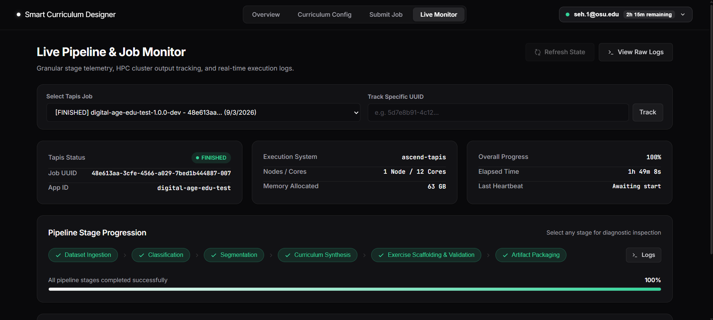

### Directory Structure & Deliverables

#### 1. `models/`
- `.pth` weights for the trained DINOv2 vision transformer classification model.
- `sam_vit_b_.pth` weights for the Segment Anything Model (SAM).

#### 2. `{output_directory_name}/`
- **`results.json`:** Overall quantitative evaluation metrics for pipeline training and inference.
- **`class_mapping.json`:** Index mapping connecting target domain class names to numeric class IDs.
- **`confusion_matrix.png`:** Cross-validation confusion matrix compiled across training folds.
- **`eval_confusion_matrix.png`:** Final model evaluation confusion matrix across the full dataset.
- **`curriculum.json`:** Master machine-readable curriculum structure.
- **`curriculum_{grade_level}.md`:** Formatted markdown syllabus and pedagogical guide tailored to the target grade level.
- **`cv_report.json`:** Detailed computer vision performance breakdown per fold.
- **`results.csv`:** Data sheet containing individual image predictions, ground truth, and confidence scores.
- **`parallel_telemetry.json`:** Execution timing, memory usage, and GPU telemetry across parallel workers.
- **`provenance.json`:** Artifact-to-module lineage ledger establishing which data fixtures were used to generate each student assignment.

#### 3. `{output_directory_name}/exercises/`
Organized into weekly modules (`Week_{xx}/Module/`):
- **`concepts.md`:** Pedagogical background explaining core theory (convolutions, attention, loss functions, etc.).
- **`{concept}_exercise.py`:** Scaffolded student assignment containing docstrings, type hints, and `# TODO` milestones. (Initially designed with failing unit tests until implemented).
- **`{concept}_solution.py`:** Fully implemented reference solution for instructors.
- **`{concept}_test.py`:** Property-based unit tests for immediate feedback and autograding.
- **`resources.md`:** Recommended extension readings, documentation, and research citations.

#### 4. `{output_directory_name}/images/`
- **`masks/`:** Ground truth and generated binary masks used for segmentation tasks.
- **`segmented/`:** Segmented visual crops and masked imagery produced by SAM.

---

## Accessing and Downloading Outputs

Within the **Live Monitor** page, scroll down to the **Job Output Filesystem** explorer card. 

The embedded file browser allows you to navigate the complete output tree just like the Tapis Portal:
- Click into any directory to browse nested files and student modules.
- Click **👁 View** on any script, markdown, JSON, or CSV file to inspect its contents directly in your browser.
- Click **⬇ Download** to save any file or deliverable directly to your local computer.

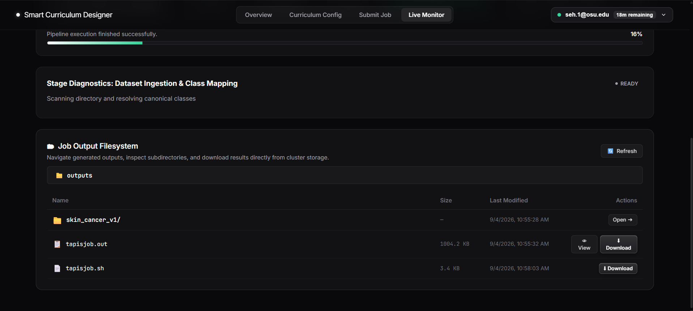

# Contributing to Smart Curriculum Designer

Thank you for helping improve Smart Curriculum Designer. Contributions may include bug reports, documentation improvements, new curriculum templates, dataset scanners, model evaluation stages, workflow or configuration artifacts, and code changes.

## Before Contributing

1. Read the [README.md](README.md), [HOW_TO_USE.md](documentation/HOW_TO_USE.md), and [YAML_CONFIG_GUIDE.md](documentation/YAML_CONFIG_GUIDE.md).
2. Review open issues and pull requests to avoid duplicate work.
3. **Do not submit credentials, private keys, proprietary data, restricted data, sensitive locations, personally identifiable information, or material that you are not authorized to share.**
4. Use the issue templates to report a problem or propose a change before beginning a substantial contribution.

## Contribution Pathways

The project welcomes contributions in increasing order of technical and maintenance responsibility:

1. **Execute an example**: Run a sample pipeline configuration (e.g. `configs/skin_cancer_config.yaml` or `configs/food_config.yaml`) and report any problems.
2. **Improve documentation or tutorials**: Refine user guides, YAML parameter descriptions, or educational explanations.
3. **Add or improve automated tests**: Expand test coverage for dataset scanners, Jinja2 template renderers, or metric extractors.
4. **Propose curriculum templates & datasets**: Author new Jinja2 template modules (`digitalagedu/templates/`) or domain dataset adapters.
5. **Prepare a bounded code contribution**: Submit modular enhancements to the orchestrator, vision stages, or practice generators.

## Pull Requests

A pull request should:

- Reference the related issue or explain the user/maintainer problem being addressed.
- Be limited to one coherent, self-contained change.
- Include or update unit tests when practical (`pytest`).
- Update documentation when user-visible behavior, interfaces, configuration parameters, installation steps, or limitations change.
- Identify dependencies, data assumptions, security implications, and maintenance implications.
- Not include secrets, unreviewed large binary weights, private datasets, or unlicensed materials.

Maintainers may request changes, defer a contribution, or decline it when the change lacks a clear maintenance owner, conflicts with project scope, introduces unacceptable security or data risks, or cannot be reviewed with available resources.

## License and Contributor Rights

By submitting a contribution, you represent that you have the right to submit it and that it may be distributed under this repository's MIT license. If your employer, institution, funder, or data provider imposes restrictions, obtain authorization before contributing.

## Security Issues

Do not report suspected vulnerabilities in a public issue. Follow [SECURITY.md](SECURITY.md).

# Security Policy

## Supported release

Security fixes are evaluated for the most recent tagged release and the default branch. The supported-release policy will be updated as the project establishes a release cadence.

## Reporting a vulnerability

Do not open a public issue for a suspected vulnerability or exposure of credentials, restricted data, or sensitive configuration. Report it privately to:

- Security contact: **Jason Seh <seh.1@osu.edu>**
- Security contact: **Hari Subramoni <subramoni.1@osu.edu>**
- Backup contact: **[GitHub private security advisory](https://github.com/ICICLE-ai/smart_labeler/security/advisories/new)**

Include a concise description, affected version or commit, reproduction steps when safe to provide, potential impact, and any suggested mitigation.

## Maintainer response

Maintainers will acknowledge receipt, assess severity and scope, coordinate remediation, and determine whether a security advisory, patch release, configuration change, or documentation update is needed. The project does not promise a specific response time until maintainers adopt and resource one.

## Contributor security expectations

Contributors must not commit secrets, credentials, private certificates, proprietary data, restricted datasets, or malicious code. Contributions that add dependencies, services, data interfaces, workflow execution paths, or deployment configuration must identify the new dependency or trust boundary and any required credentials or permissions.

