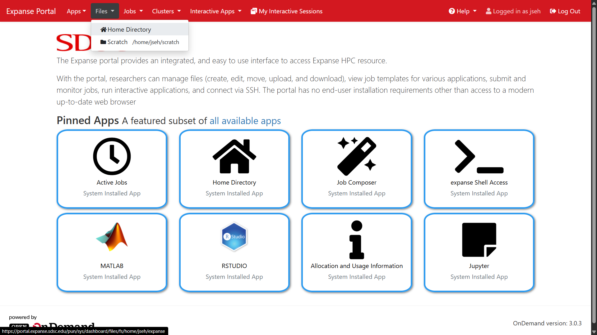
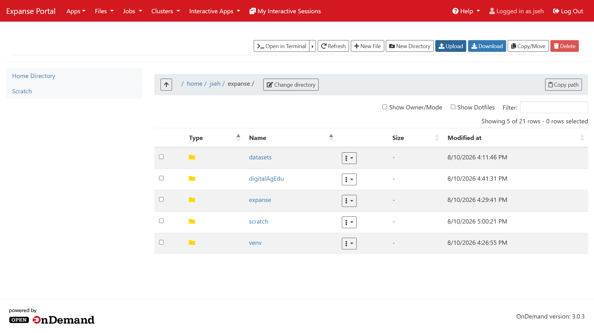
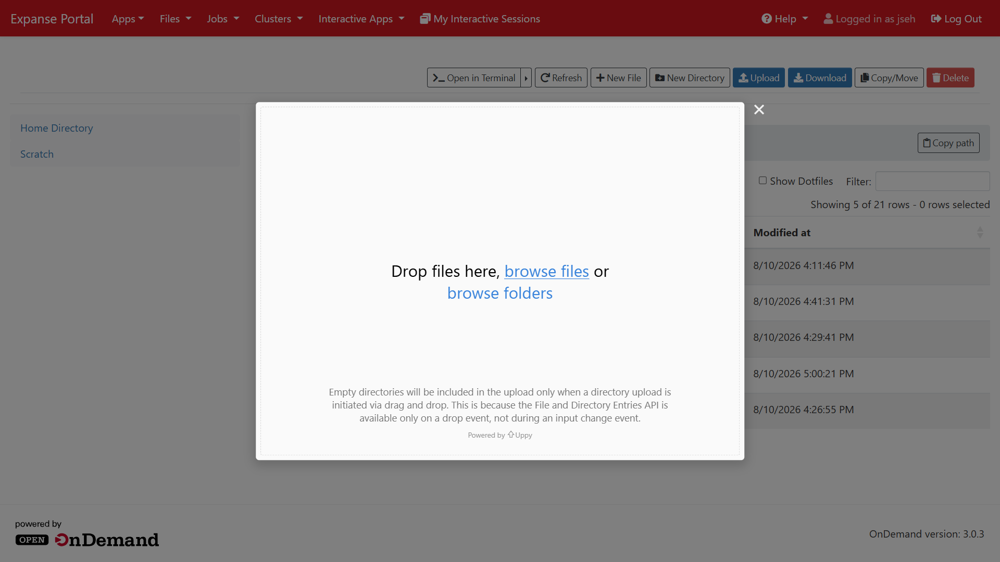
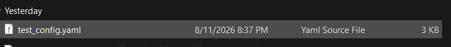
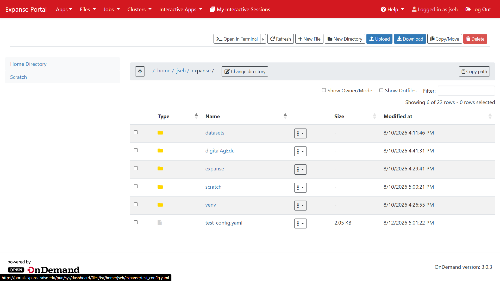

# YAML Configuration Guide

DigitalAgEdu expects a YAML configuration to run correctly. This acts as the main point of freedom for educators to determine the content for their curriculum. Each parameter outlined here serves a purpose and unless otherwise specified needs to be filled out. Please refer to the sample YAML configuration listed below this document and on the line below. Additionally, please read the section Uploading to a System upon creating your config file.

A sample YAML configuration can be found [here](#sample-yaml-config).

____________________________________________________________________________

### Implemented Parameters

#### Project
- **`domain`:** This is used by the VLM to define its background expertise.
- **`context_statement`:** A description of the problem. This is used by the automated curriculum generator to construct course topics, and by the VLM to structure its answers.
- **`use_case`:** Reserved for future extension. Changing this does not affect execution.

#### Dataset
- **`root_path`:** The absolute or relative path to the directory containing your images. Ensure the subfolders of the main directory are named the classes of the images. Eg:
  ```
  food/
       |_pasta/
       |_pizza/
       |_etc./
  ```

#### Output
- **`output`:** Configurations for the output
- **`directory`:** The destination folder where model predictions (`results.csv`), segmentation images, and execution logs will be written.

#### Pipeline
- **`stages`:** Sequential stages the pipeline will run. The stages run as such: Classification (DINOv2) -> Segmentation (SAM) -> VQA (Phi-3-Vision)
- **`active`:** Toggles whether this stage runs. If set to false, the pipeline skips this model completely.
- **`prompt`:** Text inputs used for visual grounding:
  - **For Segmentation:** The text prompt describing the object to isolate (e.g., "the leaf", "the skin lesion").
  - **For VisionQA:** The natural language request directed at the VLM (e.g., "Provide a concise 2-sentence explanation of the visual evidence.").

#### Execution
- **`device`:** Set to `"cuda"` for fast GPU processing on machines with NVIDIA cards (or OSC cluster nodes). Set to `"cpu"` for slower, localized execution.
- **`batch_size`:** The number of images loaded into GPU memory at once. If you hit out-of-memory (OOM) errors, lower this value (e.g. from 16 to 4).
- **`image_size`:** Square resolution to resize input images. (518 is heavily recommended)
- **`max_samples`:** Set to a number (e.g. 20) to quickly test the pipeline on a small subset. Set to null to run over the entire dataset.
- **`seed`:** An integer locking randomness across Python, NumPy, and PyTorch, ensuring your cross-validation split and weight initialization remain 100% reproducible.

#### Curriculum
- **`subject` & `grade`:** Meta details printed on the generated lesson documents.
- **`weeks`:** Optional curriculum length. If omitted, the program will sum the weeks of the modules, or default to the amount of weeks for each module if `modules.weeks` is omitted too.
- **`modules`:** 
  - **`id`:** The id of the module. Refer to the YAML sample for a full list of every module
  - **`week`:** The week the module will reside in. One week can have multiple modules.
- **`topics`:** Custom descriptions representing the core projects students will work on.
  - **`name`:** The name of the topic.
  - **`description`:** The description for the topic.
  - **`project`:** The project the topic is under.
- **`resources`:** Attaching resources relevant to the curriculum.
  - **`name`:** Name for the documentation.
  - **`url`:** URL leading to the documentation.

____________________________________________________________________________

### Uploading to a System

This section demonstrates the steps to uploading the YAML configuration to a system.

1. Navigate to https://portal.expanse.sdsc.edu/ 
2. Under **Files**, click **Home Directory**.



3. Click on **Upload** and here you may upload the configuration you created.









4. The path to your configuration file can be found by clicking the **Copy Path** button, pasting that output, and appending “/{your config name}”.
   - For example: `/home/jseh/expanse/test_config.yaml`
5. Remember/Write down this file path.

---

### Sample YAML Config

```yaml
# ==============================================================================
# BOILERPLATE CONFIGURATION FOR DIGITALAGEDU
# Instructions: Use this template for deploying new datasets on Tapis/OSC.
# Ensure all model_paths and dataset_roots point to PERSISTENT SHARED STORAGE
# ==============================================================================

# ===============
# Project Context
# ===============
project:
  domain: "<INSERT_DOMAIN> (e.g., Medical Imaging, Precision Agriculture)"
  context_statement: "<INSERT_CONTEXT> (e.g., diagnosing leaf diseases from images)"
  use_case: "educational_curriculum"

# ================
# Dataset Settings
# ================
dataset:
  # IMPORTANT NOTE: Point this to a persistent storage path
  root_path: "/path/to/shared/persistent/storage/dataset_folder"

output:
  # Output directory where results will be generated
  directory: "./outputs/experiment_v1"

# ================
# Pipeline Stages
# ================
pipeline:
  stages:
    - name: "Classification"
      active: true
      task_type: "<INSERT_TASK_TYPE>"

    - name: "Segmentation"
      active: true
      task_type: "object_extraction"
      prompt: "<INSERT_TARGET_OBJECT> (e.g., the skin lesion, the diseased leaf)"

    - name: "VisionQA"
      active: false # Recommended to have this turned off
      task_type: "visual_question_answering"
      # NOTE: Ensure HF_HOME or TRANSFORMERS_CACHE is set in Tapis to cache Phi-3-Vision
      prompt:  "Based on the classification provided, analyze the visual characteristics of the image that support this conclusion. Provide a concise 2-sentence explanation of the visual evidence."
      target_metric: "explanation_reasoning"

# ============
# Execution
# ============
execution:
  device: "cuda" # Required for DINOv2 performance
  batch_size: 16
  image_size: 518
  max_samples: null # Set to an integer (e.g., 50), null for full dataset
  seed: 42

# ==================
# Curriculum Config
# ==================
curriculum:
  subject: "<INSERT_COURSE_SUBJECT>"
  grade: 10
  weeks: 24

  modules:
  # Explicit per-week assignments (multiple modules can share the same week)
    - id: "numpy_basics"
      week: 1
    - id: "pandas_analytics"
      week: 1
    - id: "pytorch_basics"
      week: 2
    - id: "interactive_segmentation"
      week: 3
    - id: "image_datasets"
      week: 4
    - id: "custom_cnn"
      week: 4
    - id: "cnn_optimization"
      week: 4
    - id: "transfer_learning"
      week: 4
    - id: "semantic_segmentation"
      week: 4
    - id: "explainable_ai"
      week: 5
    - id: "vector_embeddings"
      week: 5
    - id: "gradio_deployment"
      week: 6

  topics:
    - name: "<INSERT_TOPIC_NAME>"
      description: "<INSERT_TOPIC_DESCRIPTION>"
      project: "<INSERT_PROJECT_NAME>"

  resources:
    - name: "Dataset Source"
      url: "<INSERT_DATASET_URL>"
```
